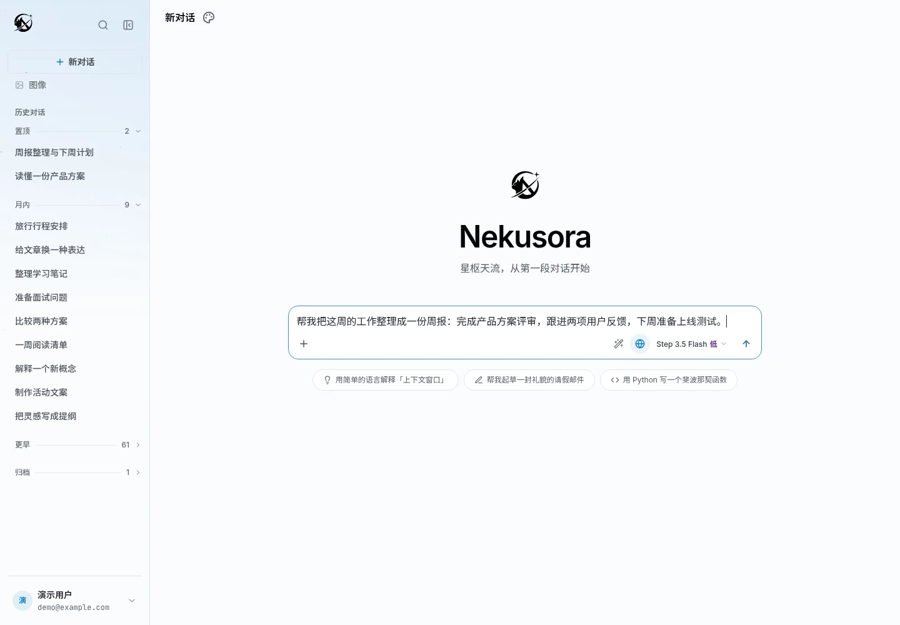
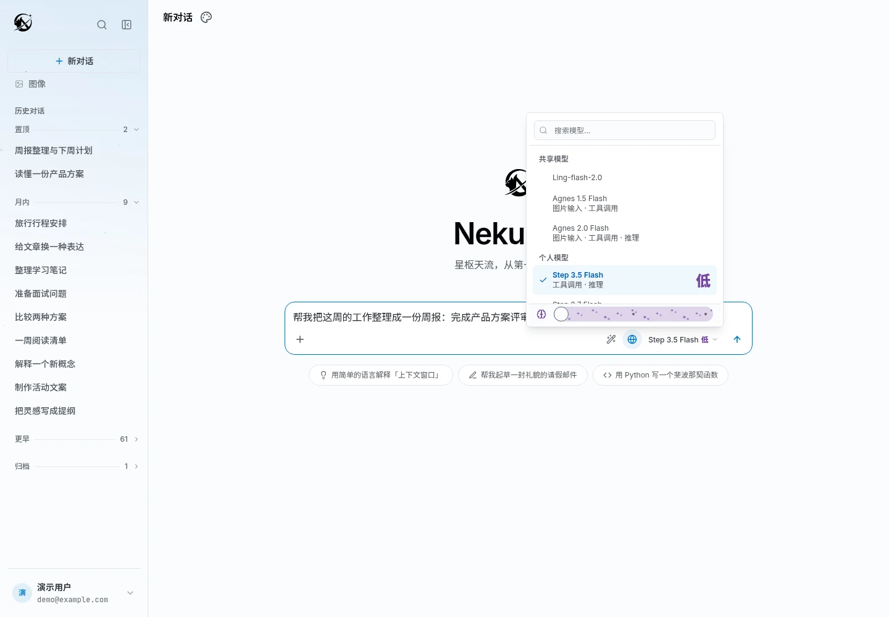
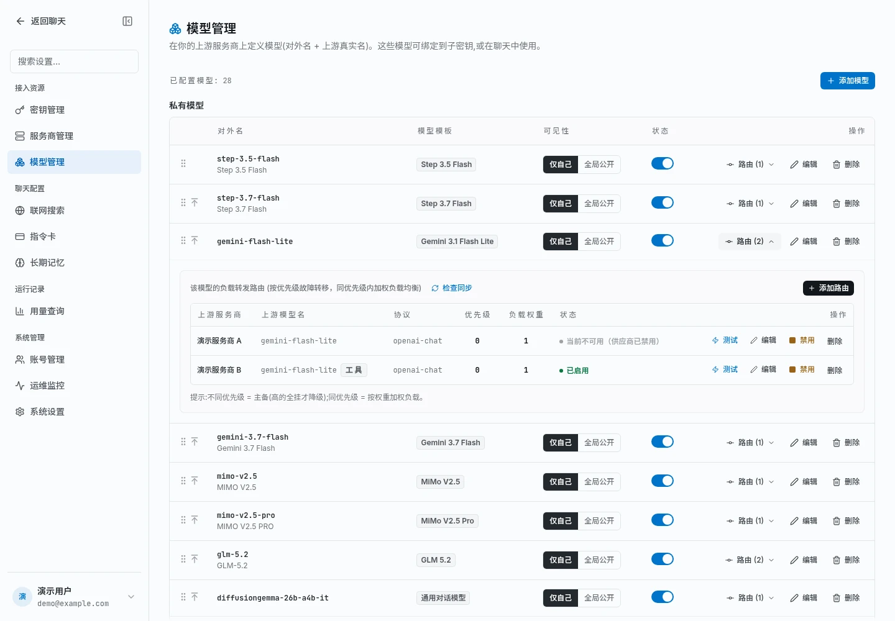
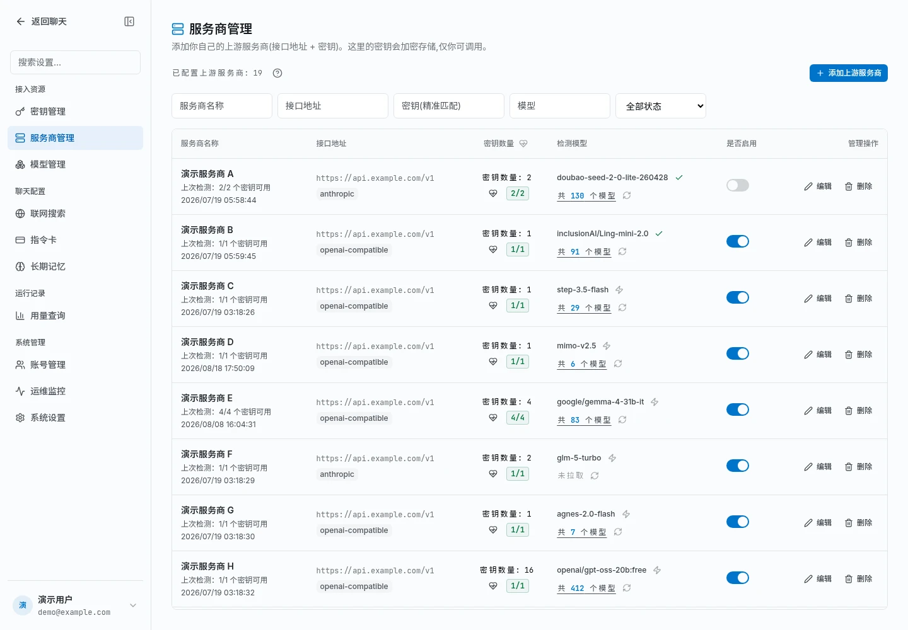
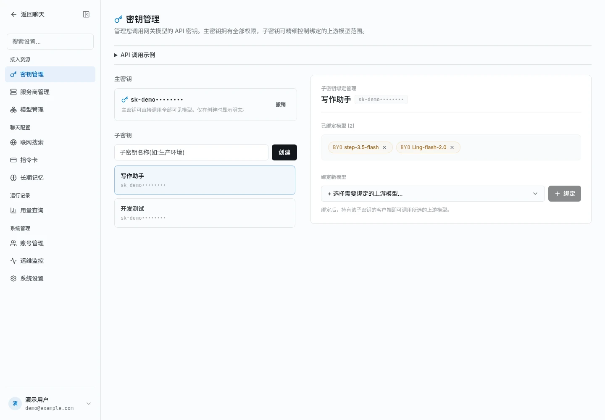
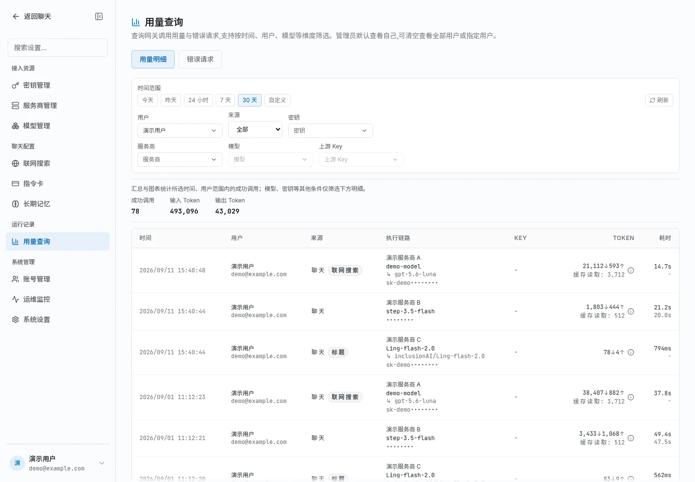

<div align="center">

# Nekusora · 星枢

**把 AI 聊天、文件问答、图像创作和模型管理放进同一个工作台。**

在网页里使用不同模型，也能把接入的模型提供给你常用的应用。

[](./LICENSE)

[能做什么](#能做什么) · [界面预览](#界面预览) · [开始使用](#开始使用) · [部署自己的星枢](#部署自己的星枢)

</div>



Nekusora（星枢）是一款可以自行部署的 **AI 聊天工作台与模型网关**。你可以用它写作、学习、整理资料，也可以把多个服务商的模型集中管理，通过一个统一的地址和密钥供其他客户端调用。

适合想拥有个人 AI 工作台的用户，也适合需要管理多个模型账号、为团队或应用提供模型入口的人。

> 星枢本身不提供模型额度。可用模型由管理员开放，或由你接入自己的模型服务；图片理解、推理、联网搜索和图像生成等能力取决于所选模型及相关配置。

## 能做什么

| 你想做的事 | 在星枢里怎么做 |
|---|---|
| 写邮件、做计划、解释概念 | 新建对话，选择模型，直接提问并继续追问 |
| 读文件、看图片、整理资料 | 上传附件，围绕内容提问；需要时开启联网搜索并查看来源 |
| 切换不同模型 | 在同一个输入框选择共享模型或个人模型，按模型能力调整推理强度 |
| 少写重复的提示词 | 把常用要求保存为指令卡，把希望跨会话保留的偏好加入长期记忆 |
| 创作图片 | 在图像工作区输入描述，选择尺寸与张数，查看历史结果并下载 |
| 整理和分享成果 | 搜索、置顶、归档对话，或生成只读分享链接 |
| 在其他应用里使用模型 | 接入服务商，配置模型，再创建供客户端使用的 API 密钥 |
| 了解使用情况 | 查看调用记录、模型用量、响应耗时和错误请求 |

## 界面预览

以下聊天与管理页面为当前界面截图，账号、会话标题、服务商地址与密钥等信息已脱敏。图像工作区单独使用示意图；截图中的模型列表不代表部署后自带这些服务。

### 聊天：从提问到整理成果

输入框集中提供附件上传、回答方式、联网搜索和模型选择。历史对话按时间分组，常用内容可以置顶，也可以通过全文搜索找回。

- **模型选择**：共享模型与个人模型集中展示，能否看图、调用工具、调整推理强度一目了然。
- **回答与阅读**：选择已启用的回答方式、切换阅读样式；代码、文档等内容可打开独立预览面板，复制或下载。
- **分享对话**：可以分享当前快照或实时同步后续内容，并设置访问密码和有效期。



### 图像：描述想法，保存结果

选择图像模型，填写画面描述，再设置尺寸和张数。生成结果与历史记录都在同一页面，可直接下载。


*上图为图像工作区示意，展示内容为演示素材。使用前需配置可用的图像模型与路由。*

### 模型管理：把多个来源放在一起

为模型设置便于识别的名称，连接一个或多个服务商。需要时配置主备顺序和分流比例，让同一个模型入口拥有多个可用来源；路由也可以单独测试、启用或停用。



<details>
<summary>查看服务商管理：添加账号、检测连接、拉取模型</summary>

集中维护服务商的接口地址与密钥，查看连接状态和可用模型，再将需要的模型接入工作台。



</details>

### 密钥管理：给不同应用分配可用模型

主密钥用于访问你自己已启用的全部模型；子密钥只开放你为它绑定的模型。可以为写作助手、开发测试等用途分别创建子密钥，按需停用。



### 用量查询：知道用了什么、哪里出了问题

在“用量明细”中查看调用量、输入输出用量和耗时，按时间、来源、密钥、服务商或模型筛选记录；调用失败时切换到“错误请求”排查。管理员还可查看其他用户的使用情况。



## 开始使用

已经有可用站点和账号，可以直接从下面的流程开始。自己搭建则先看[部署说明](#部署自己的星枢)。

### 1. 发起第一段对话

1. 登录后进入聊天页 `/chat`，点击“新对话”。
2. 点击输入框右侧的“模型配置”，选择一个可用模型；支持推理的模型会显示对应的强度设置。
3. 输入问题并发送。需要补充材料时，点击 **＋ → 上传文件**，也可以拖拽或粘贴附件。
4. 继续追问，或在侧栏将这段对话重命名、置顶、归档，方便以后找回。

可以从这些具体任务试起：

> “把这份会议记录整理成待办清单，列出负责人和截止时间。”
>
> “解释这张图里的信息，并告诉我哪些地方需要进一步核实。”
>
> “帮我把这段文字改得更简洁，保留原来的语气。”

想查近期资料时，先开启输入框旁的“联网搜索”；回答提供来源时，可打开查看。图片理解需要选择支持图片输入的模型。

### 2. 让常用要求复用起来

- **指令卡**：在设置中的“指令卡”保存常用要求，例如“先给结论，再列行动项”。聊天时输入 `/` 选择，也可以组合多张卡片。
- **长期记忆**：在“长期记忆”中添加希望跨会话保留的偏好，例如“优先使用中文，回答简洁”。可以随时查看和管理。
- **分享成果**：在对话中打开分享设置，选择快照或实时同步，再按需设置密码、有效期，把链接交给阅读者。

### 3. 生成一张图片

1. 点击侧栏“图像”，进入 `/image`。
2. 选择图像模型，描述主体、风格和画面要求。
3. 设置尺寸与张数，点击“生成”；完成后下载结果，或在历史记录中找回。

例如：“一只坐在窗边看星空的白猫，柔和的蓝色调，简洁插画，横向构图。”

如果页面提示没有可用的图像模型，先在“模型管理”中添加图像模型并配置路由，或联系管理员开放共享图像模型。

### 4. 接入自己的模型服务

如果管理员已经开放了共享模型，可以直接聊天；想使用自己的账号，按以下顺序配置：

| 顺序 | 页面 | 要做的事 |
|---|---|---|
| ① 添加来源 | 服务商管理 `/panel/providers` | 点击“添加上游服务商”，填写服务商提供的接口类型、地址和 API 密钥 |
| ② 确认可用 | 服务商管理 | 拉取模型列表，按需检测连接或模型是否可用 |
| ③ 添加模型 | 模型管理 `/panel/models` | 创建模型，添加路由，选择服务商及对应的上游模型 |
| ④ 开始使用 | 聊天 `/chat` | 确认服务商、模型与路由已启用，回到聊天页选择模型 |

同一个模型可以添加多条路由。管理员还可以将模型设为“全局公开”，供站内其他用户聊天使用。

### 5. 在其他客户端里使用

进入 **密钥管理** `/panel/keys`：生成主密钥，或创建子密钥并绑定允许调用的模型。密钥明文只在创建时展示一次，请及时保存。

星枢支持 OpenAI、Anthropic、Gemini 兼容接口。以支持自定义地址的 OpenAI 兼容客户端为例：

| 客户端设置 | 填写内容 |
|---|---|
| 接口地址 / Base URL | `https://你的站点域名/v1` |
| API Key | 在星枢“密钥管理”中创建的密钥 |
| 模型名称 | “模型管理”中的对外名，或客户端拉取到的可用模型 |

更多调用示例可以直接展开“密钥管理”页面的 **API 调用示例**。使用后，在“用量查询”查看记录。

> 网页聊天可使用管理员开放的共享模型与自己的模型；API 密钥只能调用密钥所属用户自己的模型，子密钥还需显式绑定。共享模型不会自动成为你的 API 可用模型。

## 常见问题

**登录后没有模型可选？**

请管理员开放共享模型，或接入自己的服务商和模型。模型需要启用，并至少配置一条启用的路由。

**为什么看不到联网搜索或推理强度？**

联网搜索需要先在设置中配置可用后端；推理选项随模型能力变化，只支持固定推理的模型不能自由调整档位。

**只有聊天，没有调用 API，也要创建密钥吗？**

不需要。站内聊天直接使用账号可见的模型，API 密钥用于其他客户端或应用接入。

**调用失败去哪里看？**

先到“用量查询 → 错误请求”查看记录，再到“服务商管理”检测连接，或在“模型管理”中测试对应路由。

## 部署自己的星枢

推荐使用 Docker Compose。准备好 Docker 与 Compose，在项目目录中复制配置模板：

```bash
cp deploy/production.env.example deploy/production.env
```

编辑 `deploy/production.env`，按模板填写数据库密码、加密与登录密钥、站点地址和首个管理员账号，并选择要部署的镜像版本。**不要保留模板中的占位值。** 然后启动：

```bash
docker compose --env-file deploy/production.env -f compose.production.yml up -d --pull always --no-build
```

首次启动会自动初始化数据库并创建配置中的管理员账号。访问配置的站点地址（本机默认端口为 `3000`），在 `/login` 登录，再按上面的步骤接入模型。

完整配置、外接数据库、升级、备份注意事项与停止方式见 [生产部署指南](./deploy/production.md)。已有 PostgreSQL 16 部署请先按指南完成数据库升级，勿直接复用旧数据卷启动 PostgreSQL 17。

<details>
<summary>从源码本地运行</summary>

需要 Node.js 24+、pnpm 10.34.5 与 Docker Compose。

```bash
pnpm install
cp .env.example .env.local
```

按 [环境配置模板](./.env.example) 编辑 `.env.local`，设置登录与加密密钥、管理员账号，并让 `BETTER_AUTH_URL` 与访问地址一致。然后启动本地数据库：

```bash
docker compose up -d
```

分别在三个终端运行：

```bash
PORT=3500 pnpm dev
GATEWAY_PORT=3502 pnpm dev:gateway
WORKER_HEALTH_PORT=3501 pnpm worker
```

打开 `http://localhost:3500`，用 `.env.local` 中的 `SEED_ADMIN_EMAIL` / `SEED_ADMIN_PASSWORD` 登录。本地直接调用网关时，使用 `http://localhost:3502/v1`。

</details>

## 更多资料

- [生产部署指南](./deploy/production.md)：安装配置、外接服务、升级与回滚。
- [环境配置模板](./.env.example)：本地运行与可选能力的配置项。
- [模型目录维护](./docs/model-catalog.md)：维护者同步和更新模型模板的方法。
- [产品定位](./PRODUCT.md) · [设计规范](./DESIGN.md)。

## 开源许可

[MIT](./LICENSE) © Nekusora Contributors
