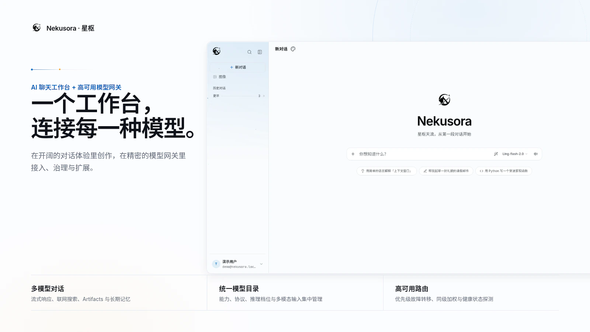
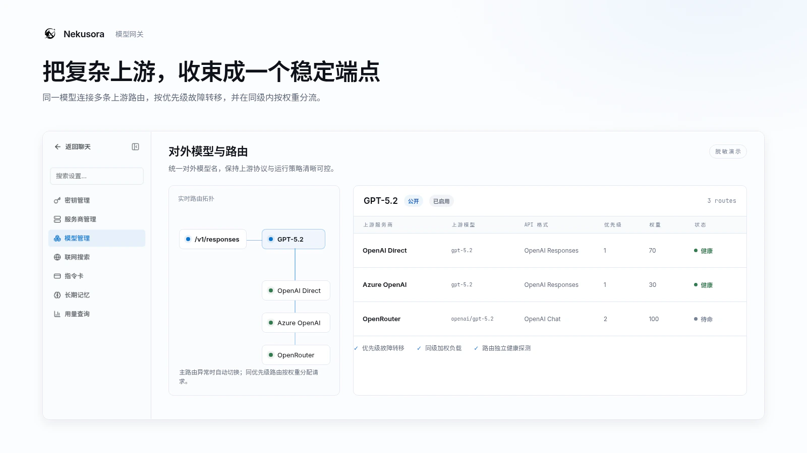
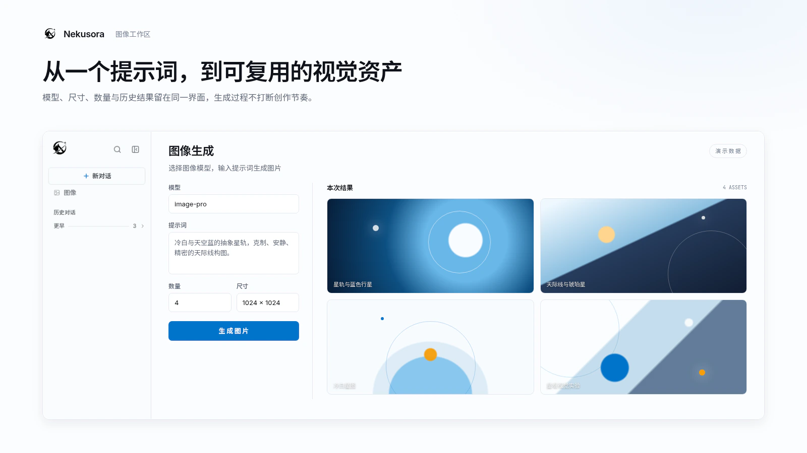

<div align="center">

# Nekusora · 星枢

**AI 聊天工作台 + OpenAI / Anthropic / Gemini 兼容模型网关**

「猫与星空」的治愈感 × 「高可用网关」的精密工程 — 一个融合 claude.ai / chatgpt 式对话体验与 sub2api / CLIProxyAPI 式 API 网关的混合型全栈平台。

[](./LICENSE)
[](https://nextjs.org/)
[](https://www.typescriptlang.org/)
[](https://orm.drizzle.team/)
[](.)

**设计主线 · 星枢天流 (The Astral Skyline)** — 天空蓝与星云纯白

</div>

---



## 概述

Nekusora(星枢,取自 Neku 猫 / Sora 天空)把两件事揉进了同一个产品里:

1. **AI 聊天工作台** —— 类 claude.ai / chatgpt 的流式对话界面,面向终端用户与提示词工程师。
2. **多协议兼容模型网关** —— 通过 `base_url + sk-*` 接入,兼容 OpenAI / Anthropic / Gemini 请求格式,带**主-子密钥层级**、**每子密钥多模型绑定**、加权负载均衡与故障转移,面向开发者与团队。

现有 OpenAI SDK 客户端可**零改动**接入网关,只需替换 `base_url` 与 `api_key`。

## 产品预览

### 高可用模型网关



### 图像工作区



---

## ✨ 特性

### AI 聊天工作台
- 流式对话(SSE)、多模型选择、多会话管理
- CJK 感知的 token 估算 + 上下文窗口裁剪(防止历史过长)
- 全局模型 + 用户 BYO 模型统一选择
- 按模型能力选择推理档位、输出模式与输出样式
- **联网搜索**:支持 Tavily / Exa / Bocha / 智谱 / SearXNG
- **Artifacts**:代码 / 文档类回答的可视化渲染面板
- **会话分享**:生成只读分享链接(`/share/:id`)
- **多模态**:图片输入、文件上传与解析
- **图像工作区**:独立的模型选择、生成与结果管理界面(`/image`)
- **记忆 (Memory)**:长期用户画像与偏好记忆
- **RAG**:基于 pgvector 的检索增强,过程面板展示可预览的文件来源
- **指令卡**:可复用并按会话组合的 System Prompt

### 多协议兼容 API 网关
- `POST /v1/chat/completions`(流式 + 非流式,严格 OpenAI 格式)
- `POST /v1/responses` —— OpenAI Responses API
- `POST /v1/messages` —— Anthropic Messages API
- `POST /v1beta/models/:model:generateContent` —— Gemini API(含流式入口)
- `POST /v1/images/generations` —— 图像生成
- `POST /v1/audio/speech` —— TTS 语音合成
- `POST /v1/audio/transcriptions` —— 语音转写
- `GET/POST /v1/mcp` —— MCP(Model Context Protocol)桥接端点
- `GET /v1/models`(返回该 key 可用模型)
- 按优先级、权重与健康状态进行负载均衡和故障转移

### 主-子密钥层级
- **主 Key**(每用户唯一):可调用该用户全部已启用模型
- **子 Key**(多个):可批量绑定多个模型,仅能调用该用户已启用且显式绑定的模型
- WebChat 可使用系统公开模型与用户自有模型;网关 Key 仅访问所属用户的模型

### 基础设施
- **数据库**:PostgreSQL(+pgvector)
- **缓存**:Redis ↔ 进程内内存 LRU 自动降级
- **队列**:pg-boss(PostgreSQL)
- **对象存储**:未配置时使用本地磁盘；显式选择 S3 / R2 / MinIO 后配置错误会阻断启动，不回退本地

### 管理
- 管理员后台:用户管理、运维监控、系统模型、输出模式 / 样式与请求治理
- 用户面板:主/子 Key、Provider / Model / Route、联网搜索、指令卡、记忆、用量与错误日志

---

## 🛠 技术栈

| 层 | 选型 |
|---|---|
| 框架 | Next.js 16 App Router + TypeScript + Turbopack |
| ORM | Drizzle ORM(PostgreSQL) |
| 缓存 | cache-manager v6 + Keyv + Redis |
| 队列 | pg-boss(PostgreSQL) |
| 认证 | Better Auth + admin 插件 + Drizzle 适配器 |
| AI | Vercel AI SDK 7(`@ai-sdk/openai` / `anthropic` / `google`) |
| 向量 | pgvector(PostgreSQL) |
| 协议 | OpenAI / Anthropic / Gemini 兼容 API + MCP SDK |
| 监控 | prom-client + `/metrics` 端点 |
| UI | TailwindCSS v4 + `@shadcn/react` + Lucide |
| 加密 | AES-256-GCM(所有 provider key 加密入库) |

---

## 🚀 快速开始

### 本地开发(PostgreSQL + 内存缓存)

要求 Node.js 24+、pnpm 10.34.5 与 Docker Compose。

```bash
pnpm install
cp .env.example .env.local    # 按需修改本地配置与密钥
docker compose up -d          # 启动 PostgreSQL(+pgvector)与 Redis
PORT=3500 pnpm dev            # Web: http://localhost:3500
GATEWAY_PORT=3502 pnpm dev:gateway # 另开终端，Gateway: http://localhost:3502
WORKER_HEALTH_PORT=3501 pnpm worker # 另开终端，Worker 健康端口: 3501
```

> 首次启动会**自动**创建首个管理员账号(读 `.env.local` 的 `SEED_ADMIN_*`)。
> PG 模式下连建表也会自动跑(`drizzle migrate`),无需手动 migrate。
> `pnpm seed` 仅用于手动重置管理员。
> 生产环境的空库必须显式设置唯一强 `SEED_ADMIN_PASSWORD`;缺失、空白或公开默认值会阻断创建。

首次登录:用 `.env.local` 里配置的 `SEED_ADMIN_EMAIL` / `SEED_ADMIN_PASSWORD` 登录 `/login`。

### 配置上游 Provider

1. 登录后进入 `/panel/providers` 添加 Provider(base_url + key,加密存储)
2. 进入 `/panel/models` 创建模型与路由,选择对应 API wire format
3. 进入 `/panel/keys` 生成主密钥,或创建子密钥并绑定模型

### 同步 pi 模型目录

同步前需在 `.env.local` 中配置 `DATABASE_URL`。默认从 pi 拉取数据并仅输出审计报告:

```bash
pnpm sync:pi-models
```

离线审计或生成迁移时，必须显式指定已审查的本地 JSON snapshot。`--write` 会把 planner 接受的已有模型 direct 更新和缺失主流模型新增写入下一条 PostgreSQL migration:

```bash
PI_MODELS_FILE=/path/to/pi-models.json pnpm sync:pi-models
PI_MODELS_FILE=/path/to/pi-models.json pnpm sync:pi-models -- --write
pnpm --filter @nekusora/web exec vitest run src/lib/reasoning.test.ts src/lib/sync-pi-models.test.ts src/lib/sync-pi-models-cli.test.ts src/lib/model-catalog.test.ts
```

人工审查新生成的 `drizzle/pg/*.sql`、source digest、`meta/_journal.json` 和新 snapshot 一致后应用:

```bash
pnpm db:migrate:pg
```

主流家族及官方 Provider 规则集中在 `packages/core/src/lib/mainstream-models.ts`。新增候选默认启用并具备 tools/system prompt；vision、reasoning 和 token 元数据必须在迁移发布前核对官方资料。同步器不直接 apply，也不创建 Provider、模型实例或路由；聚合商、区域/专项变体和模糊匹配不会自动新增。

### 调用网关(OpenAI 兼容)

```bash
# 列出可用模型
curl https://your-host/v1/models \
  -H "Authorization: Bearer sk-your-master-key"

# 对话(流式)
curl https://your-host/v1/chat/completions \
  -H "Authorization: Bearer sk-your-master-key" \
  -H "Content-Type: application/json" \
  -d '{"model":"gpt-4o","messages":[{"role":"user","content":"你好"}],"stream":true}'
```

Python / Node OpenAI SDK 零改动接入:

```python
from openai import OpenAI
client = OpenAI(base_url="https://your-host/v1", api_key="sk-your-master-key")
resp = client.chat.completions.create(
    model="gpt-4o",
    messages=[{"role": "user", "content": "你好"}],
)
```

### 生产多进程部署

生产环境使用 Web、Gateway、Worker 和 edge-router 分离的编排，只有 edge-router 发布应用端口。完整的健康依赖、路由边界、共享上传卷、连接预算和回滚步骤见 [`deploy/production.md`](./deploy/production.md)。

```bash
cp deploy/production.env.example deploy/production.env
# 内置 PostgreSQL 17(+pgvector)与 Redis
docker compose --env-file deploy/production.env -f compose.production.yml up -d --pull always --no-build
```

`deploy/production.env` 中的 `IMAGE_TAG` 固定部署版本；示例使用 `0.1.0`，升级时改为新的版本标签，也可使用滚动更新的 `latest`。

外接已有 PostgreSQL/Redis 时，将 `DATABASE_URL`、`REDIS_URL` 改为容器可访问的外部地址，直接使用外接版 Compose：

```bash
docker compose --env-file deploy/production.env -f compose.production.external.yml up -d --pull always --no-build
```

内置模式中，现有 PostgreSQL 16 数据目录不能直接由 PostgreSQL 17 启动；升级前请按 [`deploy/production.md`](./deploy/production.md) 完成大版本迁移。

---

## ⚙️ 环境变量

见 [`.env.example`](./.env.example)。关键项:

| 变量 | 说明 | 默认 |
|---|---|---|
| `DATABASE_URL` | PostgreSQL 连接串 | 必填 |
| `REDIS_URL` | Redis 连接串;留空走内存 | - |
| `DATA_ENCRYPTION_KEY` | AES-256-GCM 主密钥(64 位 hex) | 必填 |
| `BETTER_AUTH_SECRET` | 认证密钥 | 必填 |
| `BETTER_AUTH_URL` | 应用对外根 URL | `http://localhost:3000` |
| `SEED_ADMIN_PASSWORD` | 空库创建首管理员的密码;生产必须显式设置 | 开发兼容默认值 |
| `SK_PREFIX` | 签发 API key 前缀 | `sk-` |
| `STORAGE_DRIVER` | `local` / `s3` / `r2` / `minio` | `local` |
| `METRICS_ENABLED` | `/metrics` 端点开关 | `true` |

---

## 🐳 Docker 部署

Web、Gateway、Worker 三个容器共用同一生产镜像。GHCR 每 12h 检查 main，有更新时发布 `edge`；`v*` tag 发布版本标签并在配置了凭据时同步到 DockerHub：

```bash
docker pull ghcr.io/acecandy/nekusora:edge

docker pull acecandy/nekusora:latest             # v* tag，可选 DockerHub 同步
```

旧的 `nekusora-web`、`nekusora-gateway`、`nekusora-worker` 镜像地址不再更新。统一镜像仍应通过生产 Compose 启动三个独立容器，不要在一个容器内同时运行三个进程。

或仅在本地构建镜像:

```bash
docker build -t nekusora .
```

`compose.production.yml` 自带 PostgreSQL/Redis，内置 PostgreSQL 数据保存在 `postgres-data` 卷；`compose.production.external.yml` 不创建基础设施容器，只连接 `DATABASE_URL`、`REDIS_URL` 指向的外部服务。

---

## 📁 项目结构

```
apps/
  web/                       Next.js 聊天工作台与管理界面
  gateway/                   Fastify API 数据面
  worker/                    pg-boss 后台任务进程
packages/
  core/                      协议适配、Provider、路由与核心业务
  db/                        Drizzle schema 与数据库类型
  queue/                     队列目录与运行时
  contracts/                 跨进程共享契约
  observability/             指标与可观测性
drizzle/pg/                   PostgreSQL 迁移(仓库级唯一副本)
edge/                         生产入口路由
deploy/                       生产部署文档与环境模板
```

---

## 🔒 安全

- 所有 provider `api_key` 用 **AES-256-GCM** 加密入库(`DATA_ENCRYPTION_KEY`)
- 对外 `sk-*` 只存 sha256 hash,明文仅创建时一次性展示
- 启动时校验关键密钥非弱 / 非默认
- `internal` 范围模型不对外暴露(仅系统任务用)

---

## 🎨 设计

Nekusora 遵循自研设计系统「**星枢天流 (The Astral Skyline)**」:天空蓝与星云纯白的单亮色体系 —— 聊天侧温和治愈、管理侧莫兰迪灰调严谨专业。完整设计参数见 [DESIGN.md](./DESIGN.md),产品定位见 [PRODUCT.md](./PRODUCT.md)。

---

## 📄 License

[MIT](./LICENSE) © Nekusora Contributors
